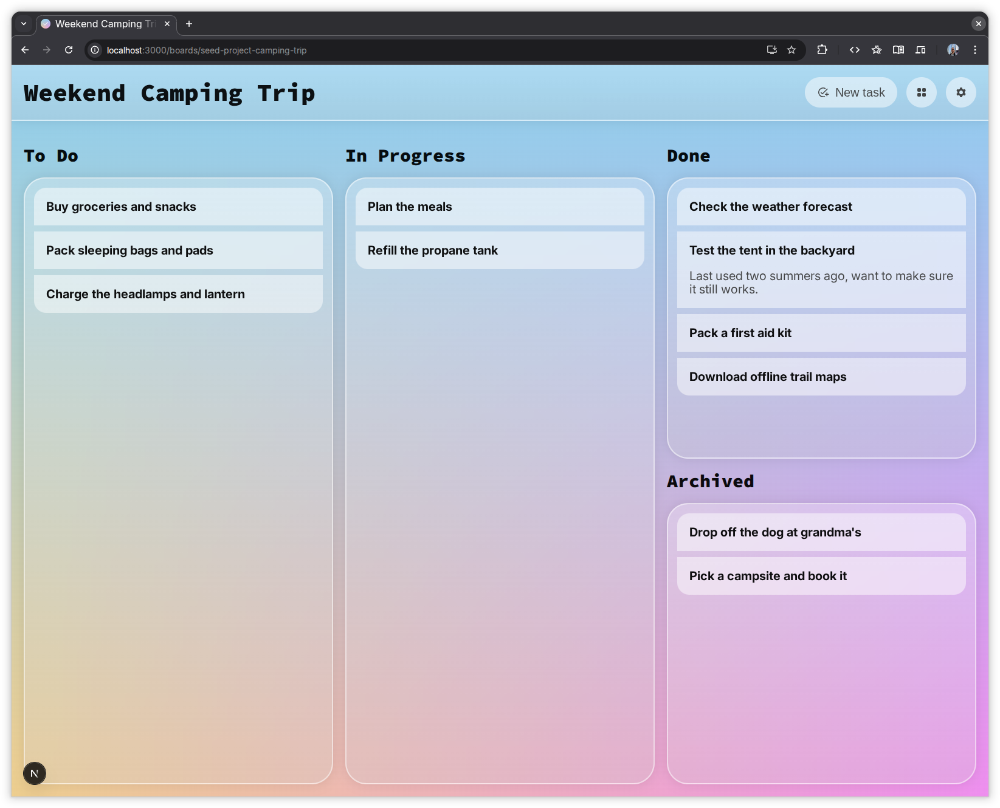

# YATL: Yet Another To-Do List

→ https://yatl-production.up.railway.app/

The world didn't need another To-Do list app. But I needed a project to play around with
* [Prisma](https://www.prisma.io/) + [SQLite](https://www.sqlite.org/)
* [railway](https://railway.com/)
* glossy transparent UI design
* agentic workflows

# Setup
## Requirements + Dependencies
* install node.js >= 25
* install dependencies with `yarn install`

## Local Setup Dev-Server
run 
* `yarn db:migrate` to update your local db schema
* `yarn db:generate` to generate the prisma client
* `yarn dev` to start the dev server on `http://localhost:3000`

## Production Build
run
* `yarn db:migrate:deploy` to apply migrations in production config
* `yarn db:generate` to generate the prisma client
* `yarn build` to create the production build

# Deploy
[railway](https://railway.com/) is connected to this repo. It uses the scripts `./build.sh` and `./start.sh` for building, database migrations and startup
